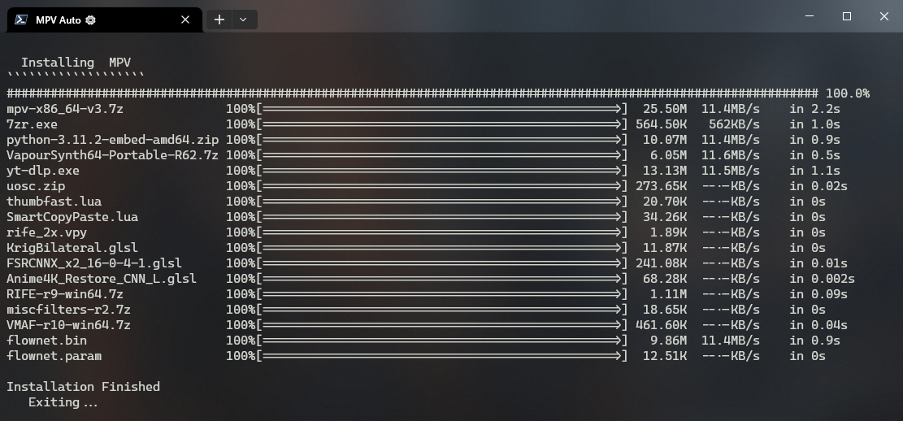

# ⚙ Auto MPV 

Automates your setup\update process for MPV Player. Fetching from external repositories, it installs VapourSynth for RIFE frame interpolation, basic shaders, scripts, and configs. It's one fully customizable batch script. Simply swap out my defaults with your own.



## 🛠️ Installation
 1. [Download](https://github.com/Hishiro64/auto-mpv/releases/latest/download/auto-mpv.zip) the latest release
 2. Extract the zip file
 3. Navigate to the `auto-mpv` directory
 4. Edit ``auto.bat`` to match your requisites (Optional)
 5. Run ``auto.bat``
 6. When MPV opens, press <kbd>Ctrl+Shift+u</kbd> to update

## 🏃‍♂️ One Line Cli Installation
  In PowerShell, just run:

  ````
  git clone https://github.com/Hishiro64/auto-mpv.git; ./auto-mpv/auto.bat
  ````

## 👀 Usage
   Drag and drop videos onto MPV or set MPV as your default video player by running ``mpv-install.bat``

- ## 🐟 Jellyfin Integration 

   Want to use this config with Jellyfin MPV Shim? Read [this](https://github.com/Hishiro64/auto-mpv/discussions/1#discussioncomment-5562678) for now. Otherwise, use the scripted integration with Jelly Indexer, Jelly Index Loader, and Command Palette.

  1. Set the link to your Jellyfin instance and the api key in ``/portable_config/script-opts/jelly-indexer.conf``

  2. Then press <kbd>Ctrl+Shift+j</kbd> to index your Jellyfin library and <kbd>Ctrl+j</kbd> to load it.

  3. From here you can load movies/shows from the playlist or the search using <kbd>F8</kbd>. Here's a preview:

  

## 🎹 Key Bindings
 - <kbd>Ctrl+Shift+u</kbd> To update using Auto MPV
 - <kbd>Ctrl+Shift+j</kbd> To run Jelly Indexer
 - <kbd>Ctrl+j</kbd> To load Jelly index
 - <kbd>F8</kbd> To search your Jellyfin Libary
 - <kbd>Ctrl+u</kbd> To upscale
 - <kbd>Ctrl+a</kbd> To upscale cartoons/anime (lite)
 - <kbd>Ctrl+i</kbd> To interpolate framerate
 - <kbd>Ctrl+r</kbd> Reset upscalers
 - <kbd>Ctrl+v</kbd> To paste video link or path

