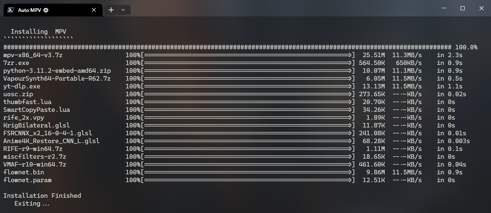

# ⚙ Auto MPV 

Automates your setup\update process for MPV Player. Fetching from external repositories, it installs VapourSynth for RIFE frame interpolation, basic shaders, scripts, and configs. It's one fully customizable batch script. Simply swap out my defaults with your own.



## 🛠️ Installation
 1. [Download](https://github.com/Hishiro64/auto-mpv/releases/latest/download/auto-mpv.zip) the latest release
 2. Extract the zip file
 3. Navigate to the `auto-mpv` directory
 4. Edit ``auto.bat`` to match your requisites (Optional)
 5. Run ``auto.bat``
 6. When MPV opens, press <kbd>Ctrl+Shift+u</kbd> to update

## 🏃‍♂️ One Line Cli Installation
  In PowerShell, just run:

  ````
  git clone https://github.com/Hishiro64/auto-mpv.git; ./auto-mpv/auto.bat
  ````

## 👀 Usage
   Drag and drop videos onto MPV or set MPV as your default video player by running ``mpv-install.bat``

## 🎹 Key Bindings
 - <kbd>Ctrl+Shift+u</kbd> To update using Auto MPV
 - <kbd>Ctrl+u</kbd> To upscale
 - <kbd>Ctrl+a</kbd> To upscale cartoons/anime (lite)
 - <kbd>Ctrl+r</kbd> Reset upscalers
 - <kbd>Ctrl+i</kbd> To interpolate framerate
 - <kbd>Ctrl+v</kbd> To paste video link or path

